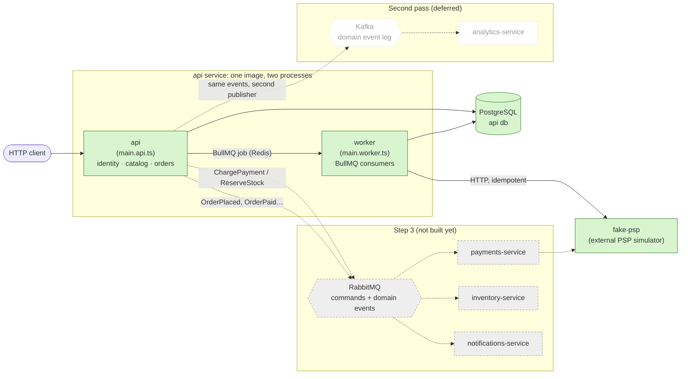
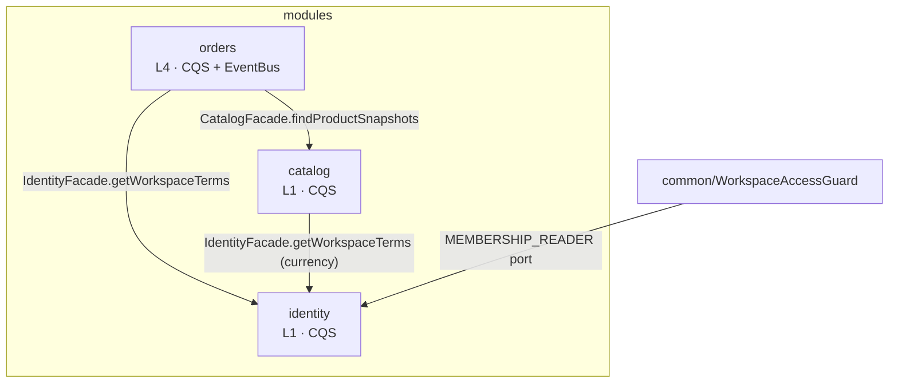
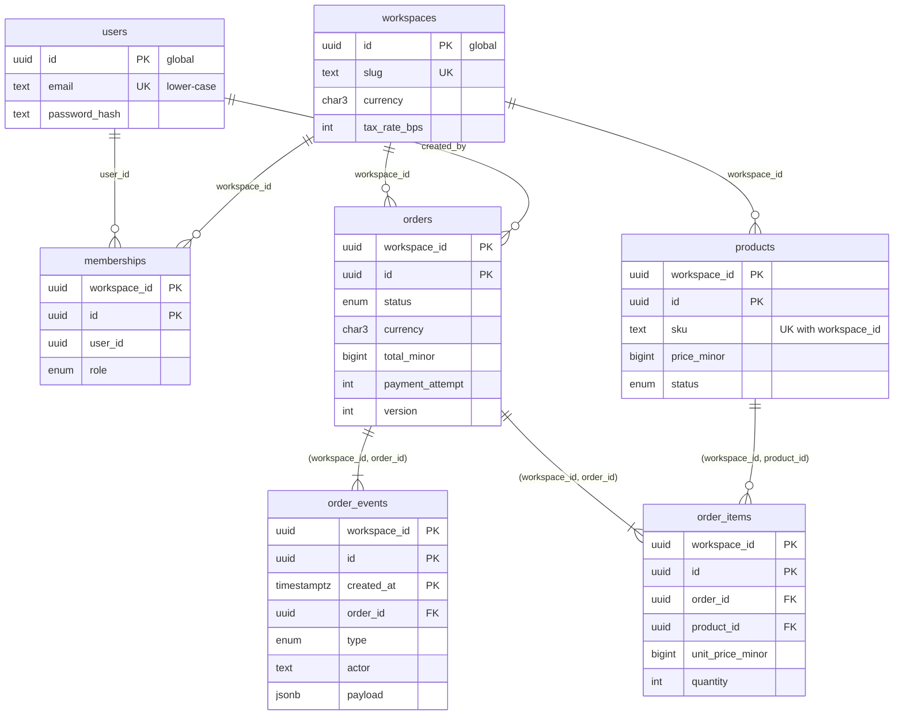
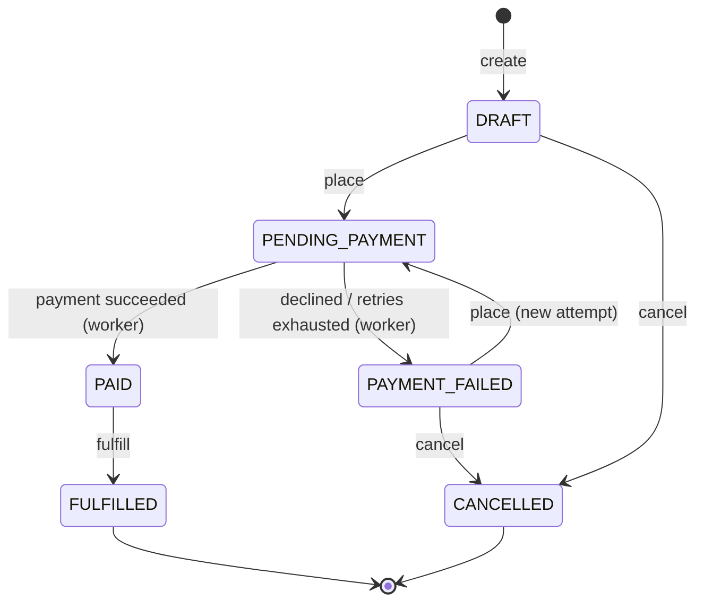

# Architecture

A multi-tenant order management backend that grows one step at a time. This document
describes the **target** architecture and marks what exists after **Step 0**.

## 1. Target architecture



| Component               | Responsibility                                                                  | Status     |
| ----------------------- | ------------------------------------------------------------------------------- | ---------- |
| `api` (HTTP)            | identity & tenancy, catalog, orders; later orchestrates the order saga          | **Step 0** |
| `api` worker            | background jobs (BullMQ): payment charging; later saga timeouts, scheduled jobs | **Step 0** |
| `fake-psp`              | simulated external payment provider (`devtools/`, not part of the system)       | **Step 0** |
| `payments-service`      | payments, idempotent charges and refunds against the PSP                        | Step 3     |
| `inventory-service`     | stock levels, reservations                                                      | Step 3     |
| `notifications-service` | emails on order events                                                          | Step 3     |
| `analytics-service`     | read-model aggregates from Kafka events                                         | deferred   |

Target communication: **RabbitMQ** for commands and replies between services and, in the
first pass of the roadmap, for domain events too (topic exchange `events`, one queue per
subscriber); **BullMQ** for jobs inside one service; **PostgreSQL** database per service.
**Kafka** as the domain event log is deferred to the second pass (`docs/ROADMAP.md` → Другий
прохід): the outbox relay publishes through a port, so Kafka arrives as a second adapter.

## 2. Process model

- One repository, one image (`services/api/Dockerfile`), two entrypoints:
  `src/entrypoints/main.api.ts` (HTTP) and `main.worker.ts` (queue consumers, no HTTP).
- Every business module is a **core module** (domain, application, persistence, read side)
  plus one **transport module** per transport (`*.http.module.ts`, `*.worker.module.ts`).
  Only transport modules reach an entrypoint; anything that starts on its own (the
  `@Processor`, the cron schedule) lives only in `orders.worker.module.ts`, imported only by
  `WorkerModule`. Cron is a BullMQ job scheduler on the module's queue: the consumer routes
  the tick to a `*.job.ts` class.
- Migrations are a separate one-shot step (`migrate` compose service), never part of `CMD`.

## 3. Modules and allowed dependencies



- Modules talk only through facades (`index.ts` is the only import path, enforced by ESLint).
- Within `orders` (level 4) the layers are enforced by `eslint-plugin-boundaries`:
  `domain` imports nothing framework-related; `application` sees `domain`, `ports`,
  `common`, `shared` and other modules' `index.ts`; `infrastructure` implements `ports`.
- Ports in `orders`: `PaymentGateway` (HTTP adapter → fake-psp, fake in-process adapter,
  chosen by `PAYMENT_GATEWAY=http|fake`), `OrdersRepositoryPort`, `PaymentChargeScheduler`
  (BullMQ today, outbox in Step 3). Step 3 extracts payments by adding one more
  `PaymentGateway` adapter; domain and use cases do not change.

| Module   | Owns tables                             | Exposes                                               |
| -------- | --------------------------------------- | ----------------------------------------------------- |
| identity | `users`, `workspaces`, `memberships`    | `IdentityFacade` (membership lookup, workspace terms) |
| catalog  | `products`                              | `CatalogFacade` (product snapshots for orders)        |
| orders   | `orders`, `order_items`, `order_events` | nothing yet (no consumer)                             |

## 4. Data model



- **Global tables** `users`, `workspaces` (future Citus reference tables).
- **Tenant tables** have `workspace_id`, PK `(workspace_id, id)`, and FKs between them
  include `workspace_id`, so a row can never point into another tenant.
- `order_events` is append-only with PK `(workspace_id, id, created_at)` and is partitioned
  `BY RANGE (created_at)`, one partition per UTC month (`order_events_YYYY_MM`, Step 2.3,
  ADR 0005). There is no DEFAULT partition: a month without one rejects the write. The worker
  job `maintain-order-event-partitions` (daily and at boot) keeps
  `ORDER_EVENTS_PARTITIONS_AHEAD` months ready and drops months past
  `ORDER_EVENTS_RETENTION_MONTHS` (0 = keep everything, the default). A read by `order_id`
  alone probes every partition, so the history query bounds `created_at` by the order's
  `created_at … updated_at`.
- Money is `BIGINT` minor units; ids are UUIDv7 from the application; timestamps `timestamptz(3)`.
- Invariants the schema can express are `CHECK` constraints (hand-written in the first
  migration): price range, quantity range, line total, totals equation, discount shape.
- Indexes: only what Step 0 queries need (keyset lists by `(workspace_id, [status,]
created_at DESC, id DESC)`, FK columns, uniques).

## 5. Order state machine



Items and discount change only in `DRAFT`. Every transition appends an `order_events` row
in the same transaction as the order update. Any other transition → `422`.

## 6. Payment flow

```mermaid
sequenceDiagram
  autonumber
  actor C as Client
  participant API as api (PlaceOrderService)
  participant DB as PostgreSQL
  participant Q as Redis (BullMQ)
  participant W as worker (OrdersConsumer)
  participant PSP as fake-psp

  C->>API: POST /orders/{id}/place { version }
  API->>DB: BEGIN; order → PENDING_PAYMENT, attempt++, insert ORDER_PLACED; COMMIT
  Note over API: OrderPlaced (in-process) fires after commit
  API->>Q: add charge-order, jobId charge-{id}-{attempt}
  Note over API,Q: NOT atomic with the commit (Known gap → Step 3 outbox)
  API-->>C: 202 { id, status: PENDING_PAYMENT } + Location
  Q->>W: charge-order { workspaceId, orderId, attempt }
  W->>DB: load order (tenant bound from job); still PENDING_PAYMENT with this attempt?
  alt stale or duplicate job
    W-->>Q: done, nothing happens
  else awaiting this attempt
    W->>PSP: POST /charges, Idempotency-Key {id}:{attempt}, timeout 3 s
    alt succeeded
      W->>DB: BEGIN; → PAID + PAYMENT_SUCCEEDED; COMMIT
    else declined
      W->>DB: BEGIN; → PAYMENT_FAILED (declineCode) + PAYMENT_FAILED; COMMIT
    else 5xx / timeout / network
      W-->>Q: throw → retry (5 attempts, exponential backoff)
      Note over W: last attempt → PAYMENT_FAILED (psp_unavailable)
    end
  end
  C->>API: GET /orders/{id} (poll until PAID / PAYMENT_FAILED)
```

The PSP call never runs inside a database transaction: `ProcessOrderPaymentService` has no
transaction; `CompleteOrderPayment` / `FailOrderPayment` each open their own.

## 7. Tenancy

- The tenant is the **workspace**. All workspace routes are `/v1/workspaces/{workspaceId}/…`.
- `AuthGuard` (global) validates the JWT and builds the `UserActor` (no roles on it).
- `WorkspaceAccessGuard` (`@WorkspaceScoped()`) loads the caller's membership through the
  `MEMBERSHIP_READER` port. **Not a member → 404**, for existing and non-existing workspaces
  alike. A member gets the tenant bound in CLS (`TenantContext`).
- Policies get the membership and decide **403**. The domain decides **422**.
- **Single choke point:** `infrastructure/database/tenant-scope.extension.ts`, a Prisma
  client extension on every tenant model: it adds `workspace_id = <tenant>` to every filter,
  checks that every write carries the same workspace, and throws when no tenant is bound.
  Repositories, query services and `@Transactional()` all use this scoped client.
- **Second layer, in Postgres (Step 2.4, ADR 0006):** Row-Level Security on the five tenant
  tables compares `workspace_id` with the transaction-local setting `app.workspace_id`. The
  api and the worker connect as `oms_app`, which owns no table and cannot bypass the policies;
  migrations, seed and datagen connect as the owner (`DATABASE_ADMIN_URL`). The setting is
  written in `infrastructure/database/` only: `transactional.adapter.ts` sets it as the first
  statement of every `@Transactional()`, and the extension wraps a query outside one in
  `BEGIN; set_config; query; COMMIT`. Without a tenant the database returns no row and
  refuses every write.
- The worker binds the tenant from the job's `workspaceId` (`TenantContext.runInWorkspace`).
- Documented exceptions, all in `identity`: (1) the membership lookup the guard performs
  before a tenant exists, (2) "my workspaces" and `/me` (cross-tenant by nature), both via
  the unscoped `PrismaService.asUser(userId, …)`: it sets `app.user_id`, and the policy
  `own_memberships` shows a user their own memberships, read-only; (3) creating a workspace
  writes its OWNER membership as a nested create, in a transaction bound to the new
  workspace's id (`TenantContext.runInWorkspace`), so the policy accepts it. Not covered by
  the extension: raw SQL and nested relation writes from global models; Row-Level Security
  covers both.
- Raw SQL exists in one place: `orders/infrastructure/postgres-order-event-partitions.adapter.ts`
  reads the catalog and calls `create_order_events_partition` / `drop_order_events_partition`
  through the unscoped `PrismaService`. The functions are `SECURITY DEFINER`: the application
  role may execute them and cannot run DDL itself. They touch the table's structure, never a
  tenant's rows, and run from a job with no workspace bound.
- The partitions of `order_events` carry no grant: the application reaches them only through
  the parent, where the policy applies. A new table needs its own `GRANT` and, with a
  `workspace_id`, its policy; `test/tenancy/row-level-security.int-spec.ts` fails otherwise.
- Shared tables + RLS is the project's one tenancy mode. Schema-per-tenant and
  database-per-tenant were compared and not built (ADR 0007).
- **Connection pooling (Step 2.7, ADR 0008):** PgBouncer in transaction mode stands between
  `oms_app` and Postgres, under `pnpm dev` and in the containers; the owner connects directly. A server
  connection changes hands at every `COMMIT`, which is why the tenant setting is
  transaction-local: a session-level one would reach the next client.
- **Read replica (Step 2.8, ADR 0009):** an asynchronous streaming standby serves `GET`
  requests; mutating requests and the worker read the primary. The request decides, not the
  query: `READ_DB` forwards to the replica or the primary by a flag the read-routing
  interceptor sets. After a write the primary's WAL position is kept for the user in Redis,
  and their next reads go to the replica only once it has replayed that position.
- **Catalog cache (Step 2.9, ADR 0010):** a product and a list page are cached in Redis per
  workspace (cache-aside). A write increments the workspace's version, which is part of
  every key, so one `INCR` invalidates the product and all list pages. A fill reads the
  primary, never the replica, and is guarded against a stampede by single-flight, a lock in
  Redis and a TTL with jitter. Redis not answering means a read from the database.

## 8. Known gaps

| Gap                                                | Consequence today                                                                                                                                                      | Closed in                                               |
| -------------------------------------------------- | ---------------------------------------------------------------------------------------------------------------------------------------------------------------------- | ------------------------------------------------------- |
| Enqueue after commit is not atomic with the commit | If Redis is down or the process dies between commit and enqueue, the order stays `PENDING_PAYMENT` with no job                                                         | Step 3 (transactional outbox)                           |
| `PENDING_PAYMENT` cannot be cancelled              | A stuck order (see above) cannot be cancelled by users                                                                                                                 | Step 3 (saga with compensation)                         |
| No rate limiting                                   | A noisy tenant is not limited; brute force on `/auth/login` is not throttled                                                                                           | deferred: roadmap 2.10, second pass                     |
| Default Nest logger only                           | Unstructured logs, no correlation ids, no `correlationId` in error bodies                                                                                              | Step 4 (pino, OpenTelemetry)                            |
| No health checks, no graceful shutdown             | Compose/k8s cannot tell "started" from "ready"; in-flight jobs are cut on stop                                                                                         | Step 5                                                  |
| `Location` on two 201s points nowhere              | `POST /auth/register` and `POST /workspaces/{id}/members` return a `Location` without a GET route behind it                                                            | open: a GET route or another URL, decided with the API  |
| No `Idempotency-Key` on HTTP writes                | A retried `POST /orders` creates a second draft (place is protected by `version`)                                                                                      | Step 3 (with the saga)                                  |
| No reconciliation with the PSP                     | If every attempt times out after the PSP already charged (e.g. latency > 3 s), the order ends `PAYMENT_FAILED psp_unavailable` while the PSP holds a successful charge | Step 3 (payments-service reconciles by idempotency key) |
| Dropping a partition locks `order_events`          | `drop_order_events_partition` is a plain `DROP` (a function cannot `DETACH … CONCURRENTLY`); it gives up after 5 s and the job retries. Retention is off by default    | open: an owner-run task outside the application         |
| Seeded `PENDING_PAYMENT` orders have no job        | They stay pending forever: a fixture that shows the first gap                                                                                                          | Step 3                                                  |
