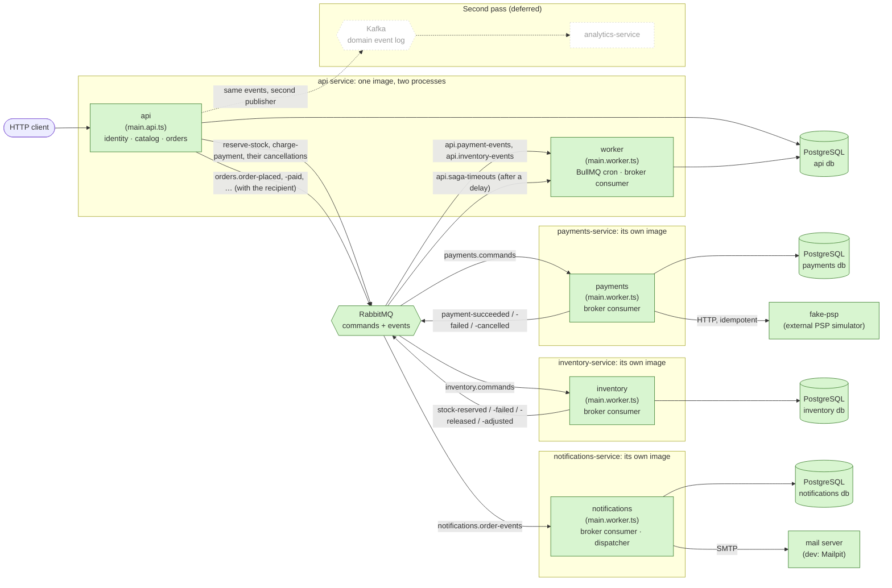
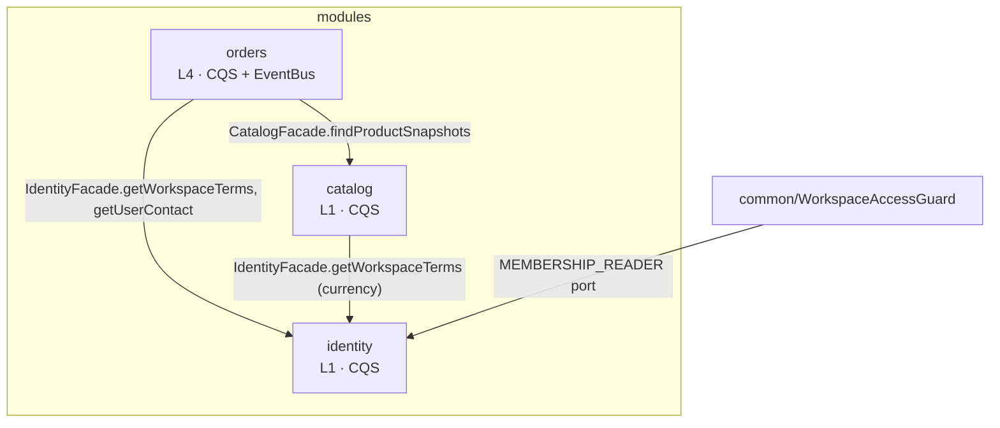
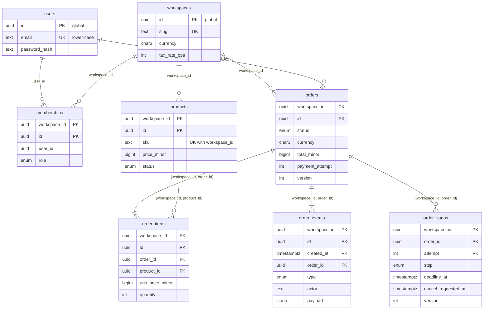
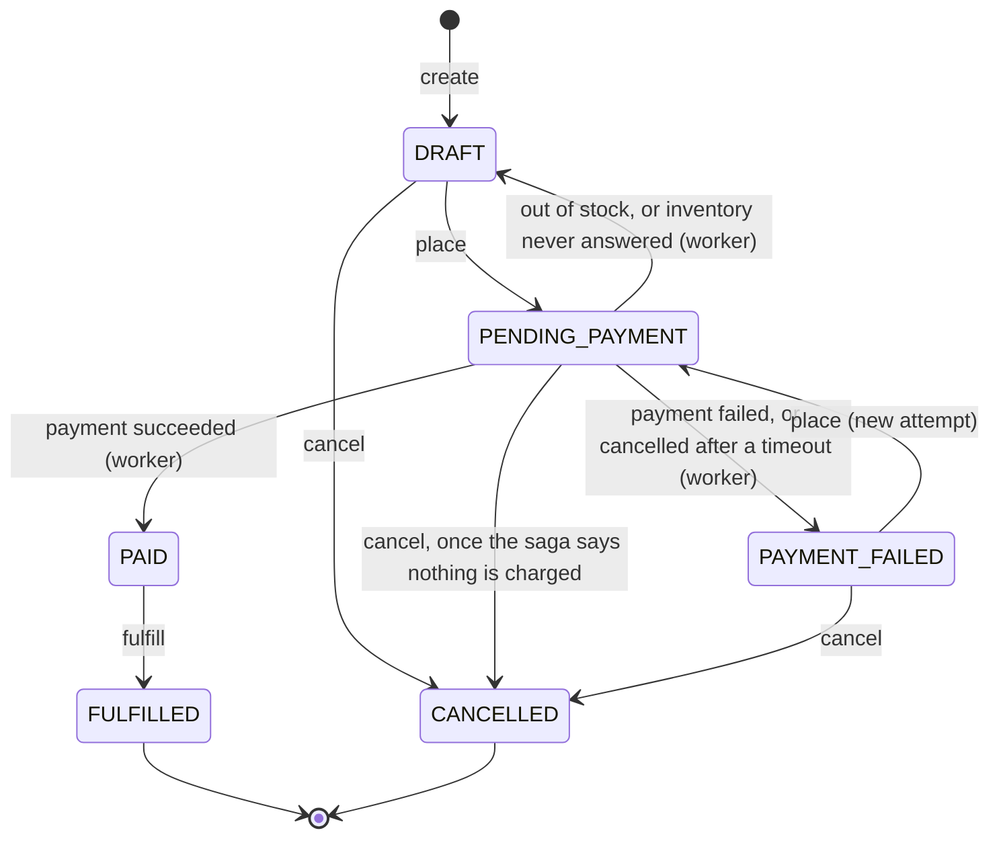
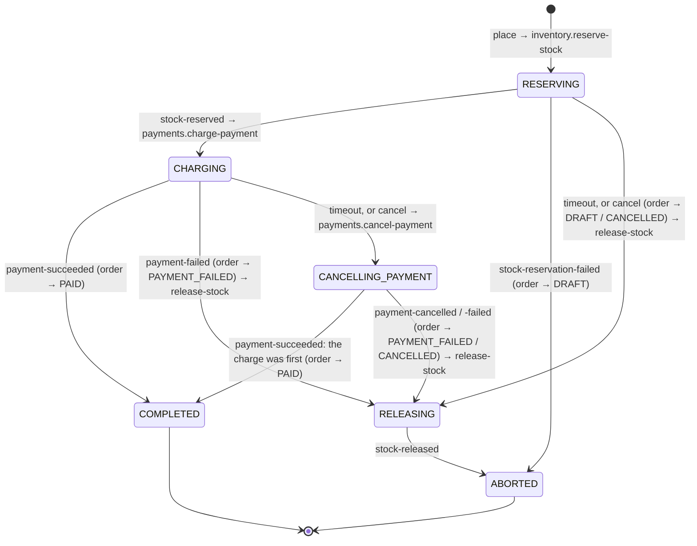

# Architecture

A multi-tenant order management backend that grows one step at a time. This document
describes the **target** architecture and marks what exists today (Step 3.12).

## 1. Target architecture



| Component               | Responsibility                                                                       | Status        |
| ----------------------- | ------------------------------------------------------------------------------------ | ------------- |
| `api` (HTTP)            | identity & tenancy, catalog, orders; starts the saga of an order (ADR 0017)          | **Step 0**    |
| `api` worker            | moves the saga on the answers of inventory and payments and on its timeouts; jobs    | **Step 0**    |
| `fake-psp`              | simulated external payment provider (`devtools/`, not part of the system)            | **Step 0**    |
| RabbitMQ                | commands and events between the services (`@oms/contracts`, ADR 0011)                | **Step 3.2**  |
| `payments-service`      | one payment attempt per command, charged once at the PSP, cancelled on a command     | **Step 3.2**  |
| `inventory-service`     | stock on hand and held per product; reserve, release, adjust on a command (ADR 0016) | **Step 3.6**  |
| `notifications-service` | a mail to the user of an order for every event about it, sent once (ADR 0019)        | **Step 3.10** |
| `analytics-service`     | read-model aggregates from Kafka events                                              | deferred      |

Communication: **RabbitMQ** for commands and replies between services and, in the
first pass of the roadmap, for domain events too. A command goes to the direct exchange
`commands` and lands in the queue of its receiver; an event goes to the topic exchange
`events`, where every subscriber has a queue of its own; the routing key is the name of the
message (ADR 0012); **BullMQ** for jobs inside one service; **PostgreSQL** database per service.
**Kafka** as the domain event log is deferred to the second pass (`docs/ROADMAP.md` → Другий
прохід): the outbox relay publishes through a port, so Kafka arrives as a second adapter.

## 2. Process model

- One repository, four services. `services/api`: one image, two entrypoints,
  `src/entrypoints/main.api.ts` (HTTP) and `main.worker.ts` (queue and broker consumers, the
  relay of the outbox, no HTTP). `services/payments`: its own image, one entrypoint,
  `main.worker.ts` (a broker consumer and the relay of its outbox, no HTTP).
  `services/inventory`: the same shape as payments, with a database of its own.
  `services/notifications`: one entrypoint as well, `main.worker.ts`: a broker consumer, the
  dispatcher that sends what the consumer wrote, and two cleanups; no outbox, because it
  publishes nothing.
- Every business module is a **core module** (domain, application, persistence, read side)
  plus one **transport module** per transport (`*.http.module.ts`, `*.worker.module.ts`).
  Only transport modules reach an entrypoint; anything that starts on its own (the
  `@Processor`, a `@RabbitSubscribe` consumer, the cron schedule) lives only in a
  `*.worker.module.ts`, imported only by `WorkerModule`. So the api process neither consumes
  from the broker nor publishes to it: it writes outbox rows, and the worker relays them. Cron is a BullMQ job scheduler on the module's queue: the
  consumer routes the tick to a `*.job.ts` class.
- The services share one package, `@oms/contracts`: the schemas of the messages and the names
  of the exchanges. Everything else a second service needs is copied into it (ADR 0012).
  The package also keeps every released version of a contract (`released/`) and the map of
  who writes a contract and who reads it (`parties.ts`): the contracts are tested against
  the first, each service against the second, with no broker and no second service
  (ADR 0021).
- Migrations are a separate one-shot step per service (`migrate`, `migrate-payments`,
  `migrate-inventory`, `migrate-notifications` compose services), never part of `CMD`.
- Every process logs JSON lines to stdout through one logger (pino behind `LOGGER`), and a
  line written while a request, a message or a job is handled carries its `correlationId`
  (ADR 0023). The id starts at the HTTP entry of the api (`x-correlation-id` of the caller,
  or a new one, returned on the answer), travels in the envelope of every message and in its
  AMQP property, is continued by the consumer that reads the message, and reaches the
  provider as a header. Where work outlives its message (the mail of a notification, the
  answer to a repeated charge command) the id is kept in the row. Each entry writes one line:
  `http request`, `message delivered`, `job run`; a use case of the api writes `use case`.
- The dev infrastructure has one container for what the services will tell about
  themselves (`lgtm`, ADR 0024): an OpenTelemetry Collector that takes OTLP and hands logs to
  Loki, traces to Tempo and metrics to Prometheus, and Grafana over the three. Metrics
  come with 4.5.
- Every process sends its traces to that Collector (ADR 0025): the OpenTelemetry SDK is a
  preload (`src/instrumentation.ts`, `node --require`), with the instrumentations of `http`,
  `pg`, `ioredis`, `amqplib` and `fetch`. Where work waits in a table for a timer, the row
  keeps the trace: `outbox.trace_context` (the relay publishes in the trace of the request)
  and `notifications.trace_context` (the mail is a span of the event). A delayed message of
  the saga keeps it as a link and begins a trace of its own. A use case of the api and a
  send to the mail server are the two manual spans.
- The log lines are in Loki, each with the `traceId` and `spanId` of the span it was
  written in (ADR 0026): the logger reads the active span as it reads the correlation id.
  They get there in two ways. A container writes to stdout and an agent (`alloy`, profile
  `app`) reads it through the Docker socket and pushes to Loki; a process under `pnpm dev`
  sends its lines to the Collector itself (`OTEL_LOGS_EXPORTER=otlp`). Loki has one label,
  `service_name`, the `service.name` of the traces; the ids are structured metadata. Grafana
  joins a line to its trace by `trace_id`, and a span to its lines by both.

## 3. Modules and allowed dependencies



- Modules talk only through facades (`index.ts` is the only import path, enforced by ESLint).
- Within `orders` (level 4) the layers are enforced by `eslint-plugin-boundaries`:
  `domain` imports nothing framework-related; `application` sees `domain`, `ports`,
  `common`, `shared` and other modules' `index.ts`; `infrastructure` implements `ports`.
- Ports in `orders`: `OrdersRepositoryPort`, `OrderSagasRepositoryPort`,
  `OrderEventPartitions`, and what the saga asks for: `StockReservationScheduler` (reserve,
  release), `PaymentChargeScheduler` (charge, cancel) and `SagaTimeoutScheduler`. Each of the
  three writes a row of the outbox in the transaction of the use case that calls it; the
  use cases reach them through `OrderSagaSteps`. `OrderRecipients` is the port the translator
  of the order events asks for the address of who created an order (ADR 0019): implemented in
  `application/` over `IdentityFacade`, because `infrastructure/` may not reach another module. The payment provider is no longer a port of the
  api: `PaymentGateway` (HTTP adapter → fake-psp, fake in-process adapter, chosen by
  `PAYMENT_GATEWAY=http|fake`) moved to payments-service with the code that calls it.
- payments-service has one module, `payments` (`layered · L1 · together`): two use cases,
  `ChargePaymentService` and `CancelPaymentService`, the table `payments`, and two ports, `PaymentGateway` and
  `PaymentEventsPublisher` (the answer, written to the outbox with the settled row).
- notifications-service has one module, `notifications` (`layered · L4 · together`):
  `RequestNotificationService` (an event → a `Notification` row, `PENDING`) and
  `DispatchNotificationService` (one due row → the mail server → `SENT`), the table
  `notifications`, and two ports, `NotificationsRepositoryPort` and `Mailer` (SMTP adapter).
- The outbox is infrastructure in the three services that publish (`src/infrastructure/outbox/`): `Outbox`
  (append in the current transaction), `OutboxRelay` and its runner, and the port
  `OutboxPublisher` with the RabbitMQ adapter. In the api it also holds `ReliableEvents`,
  where a module registers what its reliable domain events become on the broker.

| Module   | Owns tables                                            | Exposes                                                                      |
| -------- | ------------------------------------------------------ | ---------------------------------------------------------------------------- |
| identity | `users`, `workspaces`, `memberships`                   | `IdentityFacade` (membership lookup, workspace terms, the address of a user) |
| catalog  | `products`                                             | `CatalogFacade` (product snapshots for orders)                               |
| orders   | `orders`, `order_items`, `order_events`, `order_sagas` | nothing yet (no consumer)                                                    |

## 4. Data model



- **Global tables** `users`, `workspaces` (future Citus reference tables).
- **Tenant tables** have `workspace_id`, PK `(workspace_id, id)`, and FKs between them
  include `workspace_id`, so a row can never point into another tenant.
- `order_events` is append-only with PK `(workspace_id, id, created_at)` and is partitioned
  `BY RANGE (created_at)`, one partition per UTC month (`order_events_YYYY_MM`, Step 2.3,
  ADR 0005). There is no DEFAULT partition: a month without one rejects the write. The worker
  job `maintain-order-event-partitions` (daily and at boot) keeps
  `ORDER_EVENTS_PARTITIONS_AHEAD` months ready and drops months past
  `ORDER_EVENTS_RETENTION_MONTHS` (0 = keep everything, the default). A read by `order_id`
  alone probes every partition, so the history query bounds `created_at` by the order's
  `created_at … updated_at`.
- `order_sagas` (Step 3.7, ADR 0017): where one placing of an order is in its process across
  inventory and payments. One row per `(order, payment attempt)`, so its key is not
  `(workspace_id, id)`; a tenant table like the others, under Row-Level Security.
- `idempotency_keys` (Step 3.7, ADR 0018) is not in the diagram either: the answers the API
  gave to `POST /orders` and `place`, under the `Idempotency-Key` of each request, written in
  the transaction of the write. Keyed by `(user_id, scope, key)`; no tenant column, the path
  in `scope` names the workspace.
- `outbox` (Step 3.4, ADR 0014) is not in the diagram: it belongs to no tenant and points at
  nothing. One row per message for the broker (`id` = the message id, `exchange`,
  `routing_key`, `payload` = the envelope, `published_at`), written in the transaction of the
  change and published by the relay; no Row-Level Security, the tenant is inside the
  envelope. payments has the same table in its own database.
- Money is `BIGINT` minor units; ids are UUIDv7 from the application; timestamps `timestamptz(3)`.
- Invariants the schema can express are `CHECK` constraints (hand-written in the first
  migration): price range, quantity range, line total, totals equation, discount shape.
- Indexes: only what Step 0 queries need (keyset lists by `(workspace_id, [status,]
created_at DESC, id DESC)`, FK columns, uniques).

## 5. Order state machine



Items and discount change only in `DRAFT`. Every transition appends an `order_events` row
in the same transaction as the order update. Any other transition → `422`.

`PENDING_PAYMENT` is one status for the client and several steps for the system: while an
order has it, its **saga** runs (ADR 0017). The api orchestrates: it sends a command for
each step and reads the answer; the state of the process is a row of `order_sagas` per
payment attempt.



- The charge is the pivot: what was done before it is undone by a compensation
  (`release-stock`), after it nothing can fail for a business reason.
- The order gets its status when the question of money is settled, not when the saga ends:
  a declined order is `PAYMENT_FAILED` while the release of its stock is still under way.
- Every step that waits has a timeout, written with it. A timeout says "I did not hear": of
  a reservation it gives the order back and releases in the dark; of a charge it only asks
  payments to cancel, and the answer decides; of a compensation it asks again and logs an
  error.
- An answer the saga is not waiting for (a late one, one given twice, one of an earlier
  attempt) is acknowledged and changes nothing; two at once meet at the `version` of the saga.
- The steps that change no status are rows of the history too (`STOCK_RESERVED`,
  `STOCK_RELEASED`, `PAYMENT_TIMED_OUT`, `CANCELLATION_REQUESTED`, with `fromStatus = toStatus`).

A timeout is a message the api sends to itself, through the outbox like every other one:

```
outbox ──► exchange api.delayed ──► api.saga-timeouts.delay.<ms> ──(expired)──► api.saga-timeouts ──► worker
```

A queue nobody reads, whose messages expire after `<ms>` and are dead-lettered to the queue
of the worker: the same means as the retries below. Written in the transaction that begins
the step, so a step never waits without its timeout; no Redis is involved.

## 6. Payment flow

```mermaid
sequenceDiagram
  autonumber
  actor C as Client
  participant API as api (PlaceOrderService)
  participant DB as PostgreSQL (api)
  participant MQ as RabbitMQ
  participant P as payments-service
  participant PDB as PostgreSQL (payments)
  participant PSP as fake-psp
  participant W as worker (PaymentEventsConsumer)

  C->>API: POST /orders/{id}/place { version }
  API->>DB: BEGIN; order → PENDING_PAYMENT, attempt++, insert ORDER_PLACED, saga RESERVING,<br/>outbox: inventory.reserve-stock + its timeout + orders.order-placed; COMMIT
  API-->>C: 202 { id, status: PENDING_PAYMENT } + Location
  Note over W,MQ: inventory-service holds the stock and answers inventory.stock-reserved<br/>(queue api.inventory-events); the worker moves the saga to CHARGING and writes<br/>payments.charge-payment, with expiresAt, and its timeout to the outbox
  W->>DB: relay: the unpublished outbox rows, oldest first
  W->>MQ: payments.charge-payment → exchange commands (mandatory, confirmed), then mark published
  MQ->>P: queue payments.commands
  P->>PDB: insert payment PENDING, unique (order, attempt)
  alt the row exists and is settled (another command for the attempt)
    P->>PDB: BEGIN; inbox: the message; outbox: the stored outcome, again; COMMIT<br/>(the same message again: its record exists, nothing is written)
  else PENDING
    P->>PSP: POST /charges, Idempotency-Key {id}:{attempt}, timeout 2 s;<br/>again after a pause, up to 2 more calls within 7 s; no call while the circuit is open
    opt no answer (timeout, 5xx, circuit open), and a delivery is left
      P-->>MQ: reject → payments.commands.wait.30000 → back after 30 s, the row stays PENDING
    end
    P->>PDB: BEGIN; inbox: the message; PENDING → SUCCEEDED / FAILED (decline code, psp_rejected, psp_unavailable on the last delivery),<br/>outbox: payments.payment-succeeded / -failed; COMMIT
  end
  P->>MQ: relay of payments: the answer → exchange events (confirmed), then mark published
  MQ->>W: queue api.payment-events
  W->>DB: BEGIN (tenant bound from the envelope); inbox: the message
  alt the message is recorded already
    W-->>MQ: ack, nothing happens
  else the order is not PENDING_PAYMENT with this attempt (a stale event)
    W-->>MQ: ROLLBACK; ack, nothing happens
  else the write fails (database, a concurrent worker)
    W-->>MQ: reject → api.payment-events.wait.30000 → back after 30 s
  else succeeded
    W->>DB: → PAID + PAYMENT_SUCCEEDED, outbox: orders.order-paid; COMMIT
  else failed
    W->>DB: → PAYMENT_FAILED (reason) + PAYMENT_FAILED, saga RELEASING,<br/>outbox: inventory.release-stock + its timeout; COMMIT
  end
  C->>API: GET /orders/{id} (poll until PAID / PAYMENT_FAILED)
```

The PSP call never runs inside a database transaction: `ChargePaymentService` in payments
opens one only after the provider has answered, to settle the row and write the answer;
`CompleteOrderPayment` / `FailOrderPayment` in the api each open their own.

Nothing is published to the broker next to a commit (ADR 0014). A message is a row of the
table `outbox`, inserted in the transaction of the change it tells about, and each service
has a relay in its worker process that publishes the rows:

```
use case:  BEGIN; the change; INSERT INTO outbox; COMMIT
relay:     BEGIN; advisory lock (one relay at a time);
           SELECT … WHERE published_at IS NULL ORDER BY id LIMIT 100 FOR UPDATE SKIP LOCKED;
           publish one by one, each confirmed by the broker; the first failure ends the pass;
           UPDATE … SET published_at; COMMIT                         every second, or at once after a full batch
```

| Message                                                        | Written by                                            | Exchange      |
| -------------------------------------------------------------- | ----------------------------------------------------- | ------------- |
| `inventory.reserve-stock`                                      | api, `place` (a port called by the use case)          | `commands`    |
| `payments.charge-payment`                                      | api, the stock of the attempt reserved                | `commands`    |
| `inventory.release-stock`                                      | api, the compensation of the saga                     | `commands`    |
| `payments.cancel-payment`                                      | api, a charge timed out or a cancel asked             | `commands`    |
| `orders.saga-step-timeout`                                     | api, every step of the saga that waits                | `api.delayed` |
| `orders.order-placed`                                          | api, `place`                                          | `events`      |
| `orders.order-paid`                                            | api, the answer of payments recorded                  | `events`      |
| `orders.order-cancelled`, `-fulfilled`                         | api, `cancel`, `fulfill`                              | `events`      |
| `orders.order-payment-failed`                                  | api, the charge of the attempt failed                 | `events`      |
| `orders.order-returned-to-draft`                               | api, the stock was not there, or inventory never said | `events`      |
| `payments.payment-succeeded`, `-failed`, `-cancelled`          | payments, the attempt settled                         | `events`      |
| `inventory.stock-reserved`, `-reservation-failed`, `-released` | inventory, the command answered                       | `events`      |

Delivery is at least once: a relay that dies between the broker's confirm and its own commit
publishes those messages again, with the same message id (the id of the row). With the broker
down `place` still answers 202, and the command leaves when the broker is back. A command is
published `mandatory`: while its receiver has not declared its queue, the row stays
unpublished; so is a delayed message. A published row is kept 7 days.

The events of an order are read by notifications-service (ADR 0019), from its queue
`notifications.order-events`. Each carries `recipient { userId, email }`, the user who
created the order: the translator of the api reads the address from identity when it writes
the event, so a subscriber that writes to that user needs the event and nothing else.

```
orders.order-paid ──► notifications.order-events ──► OrderEventsConsumer
                                                       inbox.once():  INSERT inbox
                                                                      INSERT notifications (PENDING)
                                                     DispatchNotificationsJob, one row per transaction:
                                                       SELECT … FOR UPDATE SKIP LOCKED
                                                       SMTP ──► mail server
                                                       UPDATE notifications SET status = 'SENT'
```

The consumer sends nothing: a mail cannot be rolled back with the record of its message. It
writes the mail the service owes, and the dispatcher sends it afterwards. One notification
per fact, `UNIQUE (order_id, kind, attempt)`; a mail is made of its own event only, because
the events of one order arrive in any order. A try that fails is recorded on the row and
repeated after a delay that doubles, then given up (`FAILED`, an error in the log).

A message takes effect once per consumer (ADR 0015). Each service has a table `inbox`,
`(consumer, message_id)`, and a consumer records the message in the transaction of what it
causes:

```
BEGIN; INSERT INTO inbox … ON CONFLICT DO NOTHING;
       nothing inserted → COMMIT, acknowledge: the message was handled before
       inserted         → the use case, in this transaction; COMMIT, or ROLLBACK and the record goes too
```

Two deliveries of one message at the same moment meet at the primary key: the second waits
for the first. In the api the consumer wraps its use case (`Inbox.once`); in payments the use
case records the message in its last step, the transaction that settles the payment, because
the call to the provider comes before it and outside any transaction. A record is kept 7 days.

The inbox knows a message by its id. Another message about the same fact (payments answering
a second command for an attempt, a late answer for an old attempt) is absorbed by state, as
before. So a charge is never made twice, by four layers: the inbox of payments, the attempt
number on the order (an answer for a settled attempt is acknowledged and ignored), the unique
row per (order, attempt) in payments, and the idempotency key at the provider.

A message whose handling fails is not lost (ADR 0013). Every queue a service reads has two
more beside it:

```
<exchange> ──► <queue> ──(rejected)──► <queue>.wait.<delayMs> ──(expired)──► <queue>
                  └──(given up: publish + ack)──► <queue>.dlq
```

| Queue                  | Deliveries | Then                                                                  |
| ---------------------- | ---------- | --------------------------------------------------------------------- |
| `payments.commands`    | 4          | a provider still down: answered `psp_unavailable`; anything else: dlq |
| `api.payment-events`   | 10         | dlq                                                                   |
| `api.inventory-events` | 10         | dlq                                                                   |
| `api.saga-timeouts`    | 10         | dlq                                                                   |
| `inventory.commands`   | 5          | dlq                                                                   |

A message that is not a known contract, or that business refuses for good (no such order in
the workspace of the envelope), is parked in the dead-letter queue on its first delivery. So
is a message the broker took back 10 times from a consumer that died holding it. A parked
message is an error in the log; it is put back through the management UI ("Move messages").

## 7. Tenancy

- The tenant is the **workspace**. All workspace routes are `/v1/workspaces/{workspaceId}/…`.
- `AuthGuard` (global) validates the JWT and builds the `UserActor` (no roles on it).
- `WorkspaceAccessGuard` (`@WorkspaceScoped()`) loads the caller's membership through the
  `MEMBERSHIP_READER` port. **Not a member → 404**, for existing and non-existing workspaces
  alike. A member gets the tenant bound in CLS (`TenantContext`).
- Policies get the membership and decide **403**. The domain decides **422**.
- **Single choke point:** `infrastructure/database/tenant-scope.extension.ts`, a Prisma
  client extension on every tenant model: it adds `workspace_id = <tenant>` to every filter,
  checks that every write carries the same workspace, and throws when no tenant is bound.
  Repositories, query services and `@Transactional()` all use this scoped client.
- **Second layer, in Postgres (Step 2.4, ADR 0006):** Row-Level Security on the five tenant
  tables compares `workspace_id` with the transaction-local setting `app.workspace_id`. The
  api and the worker connect as `oms_app`, which owns no table and cannot bypass the policies;
  migrations, seed and datagen connect as the owner (`DATABASE_ADMIN_URL`). The setting is
  written in `infrastructure/database/` only: `transactional.adapter.ts` sets it as the first
  statement of every `@Transactional()`, and the extension wraps a query outside one in
  `BEGIN; set_config; query; COMMIT`. Without a tenant the database returns no row and
  refuses every write.
- The worker binds the tenant from the envelope of the message, `workspaceId`
  (`TenantContext.runInWorkspace`), before it looks at the payload.
- payments-service keeps the tenant as a column and has neither layer: no user reads its
  database, and the only way in is a command from the api (ADR 0012).
- Documented exceptions, all in `identity`: (1) the membership lookup the guard performs
  before a tenant exists, (2) "my workspaces" and `/me` (cross-tenant by nature), both via
  the unscoped `PrismaService.asUser(userId, …)`: it sets `app.user_id`, and the policy
  `own_memberships` shows a user their own memberships, read-only; (3) creating a workspace
  writes its OWNER membership as a nested create, in a transaction bound to the new
  workspace's id (`TenantContext.runInWorkspace`), so the policy accepts it. Not covered by
  the extension: raw SQL and nested relation writes from global models; Row-Level Security
  covers both.
- Raw SQL exists in one place: `orders/infrastructure/postgres-order-event-partitions.adapter.ts`
  reads the catalog and calls `create_order_events_partition` / `drop_order_events_partition`
  through the unscoped `PrismaService`. The functions are `SECURITY DEFINER`: the application
  role may execute them and cannot run DDL itself. They touch the table's structure, never a
  tenant's rows, and run from a job with no workspace bound.
- The partitions of `order_events` carry no grant: the application reaches them only through
  the parent, where the policy applies. A new table needs its own `GRANT` and, with a
  `workspace_id`, its policy; `test/tenancy/row-level-security.int-spec.ts` fails otherwise.
- Shared tables + RLS is the project's one tenancy mode. Schema-per-tenant and
  database-per-tenant were compared and not built (ADR 0007).
- **Connection pooling (Step 2.7, ADR 0008):** PgBouncer in transaction mode stands between
  `oms_app` and Postgres, under `pnpm dev` and in the containers; the owner connects directly. A server
  connection changes hands at every `COMMIT`, which is why the tenant setting is
  transaction-local: a session-level one would reach the next client.
- **Read replica (Step 2.8, ADR 0009):** an asynchronous streaming standby serves `GET`
  requests; mutating requests and the worker read the primary. The request decides, not the
  query: `READ_DB` forwards to the replica or the primary by a flag the read-routing
  interceptor sets. After a write the primary's WAL position is kept for the user in Redis,
  and their next reads go to the replica only once it has replayed that position.
- **Catalog cache (Step 2.9, ADR 0010):** a product and a list page are cached in Redis per
  workspace (cache-aside). A write increments the workspace's version, which is part of
  every key, so one `INCR` invalidates the product and all list pages. A fill reads the
  primary, never the replica, and is guarded against a stampede by single-flight, a lock in
  Redis and a TTL with jitter. Redis not answering means a read from the database.

## 8. Known gaps

| Gap                                                                      | Consequence today                                                                                                                                                                                                                                                                   | Closed in                                                                           |
| ------------------------------------------------------------------------ | ----------------------------------------------------------------------------------------------------------------------------------------------------------------------------------------------------------------------------------------------------------------------------------- | ----------------------------------------------------------------------------------- |
| The circuit of the PSP is seen in the log only                           | Opening is an `error` line, half-open a warning, closing a line; no metric and no alert. Its state is in the memory of one process: each replica of payments finds out by itself that the provider is down                                                                          | Step 4 (a metric for the state of the circuit, an alert on open)                    |
| An open circuit spends the deliveries of a command                       | A provider that is down for longer than the four deliveries (90 s) ends every attempt of that time as `psp_unavailable`; the user places the order again. A provider that fails more than 80 % of its calls is treated as down (`docs/perf/3.11-resilience.md`)                     | open (tune `PSP_BREAKER_THRESHOLD`; or hold the commands while the circuit is open) |
| Nobody is told about a parked message                                    | A message in a dead-letter queue is an `error` line; no metric, no alert. Putting it back is manual, through the management UI                                                                                                                                                      | Step 4 (metric and alert on the depth of `*.dlq`)                                   |
| The relay of the outbox is watched by nobody                             | A relay that cannot publish logs one error; the unpublished rows and the age of the oldest are not measured                                                                                                                                                                         | Step 4 (metrics outbox_pending_total, outbox_oldest_age_seconds)                    |
| payments has no migration checker and no mutation run                    | Five migrations, applied on an empty database by its e2e suite; drift and upgrade are not checked                                                                                                                                                                                   | open: a checker like the one of the api                                             |
| `inventory.adjust-stock` has no sender                                   | The saga reserves and releases; stock itself arrives only by the seed, the test suite or a message published by hand                                                                                                                                                                | open: an endpoint of the catalog that writes the command to the outbox              |
| A command parked in another service is answered only when it is put back | The saga asks again on every timeout of a compensation and logs an error, but an order whose `cancel-payment` or `release-stock` is never answered stays where it is: `PENDING_PAYMENT` with its stock held, or with stock held for an order that is already `PAYMENT_FAILED`       | Step 4 (an alert on the error and on the depth of `*.dlq`)                          |
| The stock cannot be read                                                 | No HTTP in inventory and no read model in the api: what is in stock is visible in the database only. `inventory.stock-adjusted` is published for a future reader                                                                                                                    | open: a read model in the api, fed by `inventory.*` events                          |
| Units of a paid order stay `reserved`                                    | Nothing lowers `on_hand` when an order is fulfilled, and adjustments keep no ledger (levels, not movements)                                                                                                                                                                         | open: fulfilment is not in the roadmap of Step 3                                    |
| inventory has no migration checker and no mutation run                   | One migration, applied on an empty database by its e2e suite                                                                                                                                                                                                                        | open: a checker like the one of the api                                             |
| Orders written past `place` have no saga                                 | An order the datagen wrote as `PENDING_PAYMENT` cannot be cancelled, and an answer for it is parked: its saga is not found. The seed and the migration write one                                                                                                                    | open: the datagen is for query plans, not for flows                                 |
| A saga that nobody answers asks for ever                                 | Every `ORDER_SAGA_COMPENSATION_TIMEOUT_MS` one more command goes into the queue of a service that is down, with no limit                                                                                                                                                            | Step 4 (the alert is what ends it: an operator)                                     |
| A mail can be sent twice                                                 | A notifications process that dies between the answer of the mail server and its commit sends that mail again, under the same `Message-ID`. SMTP keeps no idempotency key                                                                                                            | open: a provider whose API takes one (the id of the notification is the key)        |
| "Sent" means the mail server took it                                     | A mail that bounces later is not seen; a notification given up (`FAILED`) is an `error` line and is set back to `PENDING` by hand                                                                                                                                                   | Step 4 (an alert on the error); bounces: open                                       |
| The address of a user travels with the events                            | `recipient.email` is in the outbox of the api (7 days), in the broker until consumed, and in `notifications` (30 days). A user who changes it gets the mails of events already written at the old one                                                                               | open: `pii-encryption: no` in this project                                          |
| Every event of an order is a mail                                        | No preferences, no unsubscribe, one language; the recipient is always who created the order                                                                                                                                                                                         | open: not in the roadmap                                                            |
| notifications has no migration checker and no mutation run               | One migration, applied on an empty database by its e2e suite                                                                                                                                                                                                                        | open: a checker like the one of the api                                             |
| No rate limiting                                                         | A noisy tenant is not limited; brute force on `/auth/login` is not throttled                                                                                                                                                                                                        | deferred: roadmap 2.10, second pass                                                 |
| An error body has no `correlationId`; `fake-psp` logs no trace           | The id of a refused request is in the header `x-correlation-id` only. `fake-psp` has no SDK: its lines carry the correlation id and no `traceId` (ADR 0026)                                                                                                                         | open                                                                                |
| No health checks, no graceful shutdown                                   | Compose/k8s cannot tell "started" from "ready"; in-flight jobs are cut on stop                                                                                                                                                                                                      | Step 5                                                                              |
| `Location` on two 201s points nowhere                                    | `POST /auth/register` and `POST /workspaces/{id}/members` return a `Location` without a GET route behind it                                                                                                                                                                         | open: a GET route or another URL, decided with the API                              |
| A repeated creating `POST` is a 409, not the first answer                | `POST /orders` and `place` replay their answer for an `Idempotency-Key` (ADR 0018). A workspace, a member or a product sent twice is refused by its unique key: nothing is duplicated, but the client has to read what it created                                                   | open: the key on those routes too, once their transactions can be wrapped           |
| No reconciliation with the PSP                                           | If every call of every delivery times out after the PSP already charged (e.g. latency > 2 s), the order ends `PAYMENT_FAILED psp_unavailable` while the PSP holds a successful charge. The same for a cancelled attempt whose void fails on the last delivery of its charge command | open (payments-service reconciles by idempotency key)                               |
| Dropping a partition locks `order_events`                                | `drop_order_events_partition` is a plain `DROP` (a function cannot `DETACH … CONCURRENTLY`); it gives up after 5 s and the job retries. Retention is off by default                                                                                                                 | open: an owner-run task outside the application                                     |
| A contract test proves the shape of a message, not its meaning           | `amountMinor` that starts to mean whole units passes every check: the schema did not change. The diff of the contract file in the pull request is all there is                                                                                                                      | open (review)                                                                       |
| No consumer tells two versions of a contract apart                       | A consumer branches on the name of a message, and the routing key is the name: a `v2` lands in the `case` of `v1`. Nothing breaks while every contract has one version; CTR-021 fails for the first `v2` until its consumers branch on the version                                  | with the first `v2` of a contract                                                   |
| A mail that cannot be sent is a line in the log only                     | A try that fails is a `warn`, the last one an `error` (ADR 0023); nothing counts the notifications that wait or the tries that failed                                                                                                                                               | Step 4 (metrics of pending notifications and failed tries)                          |
| The system tests need every service up                                   | `pnpm test:system` runs four scenarios on a healthy stack (ADR 0022). A service that stops in the middle of a saga, a broker that restarts and a provider that is down are tried by hand only; readiness of the stack is asked of the broker, the services have no health endpoint  | Step 6 (chaos); health endpoints: Step 5                                            |
